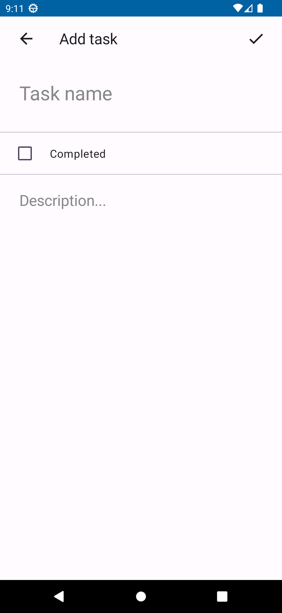

## Задача:
Создание простого списка задач (To-Do List).
## Описание:
Вам необходимо разработать приложение для управления списком задач.
Пользователь должен иметь возможность добавлять, редактировать и удалять
задачи. Главный экран приложения должен показывать список всех задач, а также
предоставлять интерфейс для добавления новых задач. Приложение должно
также поддерживать отметку выполненных задач.
## Требования:
1. Экран списка задач, отображающий название и статус выполнения задачи.
2. Экран добавления/редактирования задачи с полем для ввода названия и
чекбоксом для обозначения выполнения.
3. Возможность удаления задачи путем свайпа или долгого нажатия на задачу.
4. Использование архитектурного паттерна (например, MVVM).
5. Хранение данных о задачах с использованием SQLite или Room.
6. Поддержка адаптивного дизайна для разных экранов.
7. Использование дизайн-компонентов из популярных открытых библиотек
(например, Material Design Components или других аналогичных библиотек)
для создания интерфейса приложения. Дизайн должен быть приятен для
пользователей. Вы можете выбрать и настроить элементы дизайна в
соответствии с вашим видением

## Скриншоты:

  

